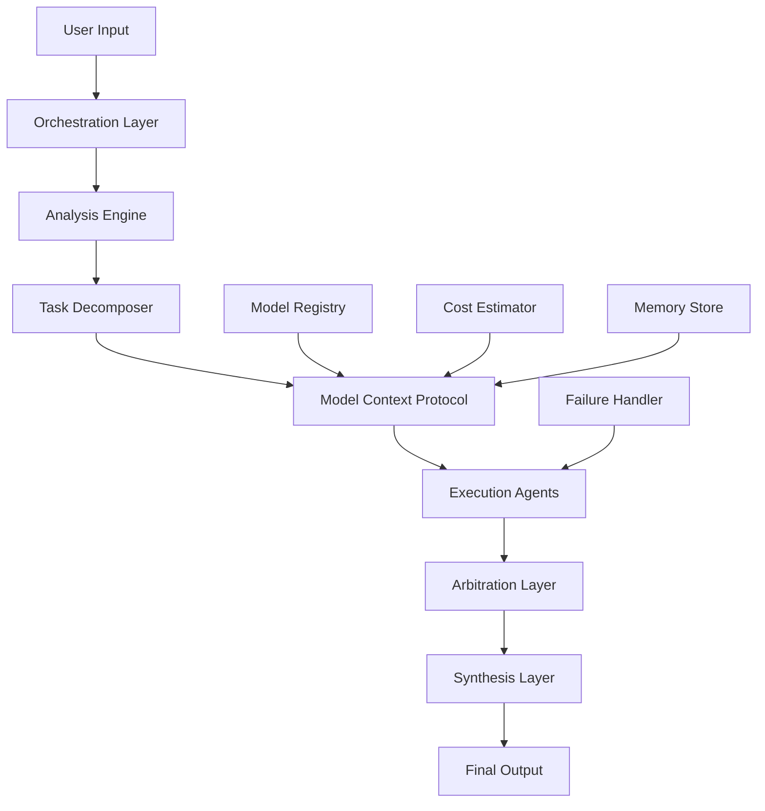

# Design Document: AI Council

## Overview

AI Council is architected as a modular, production-grade Python system that orchestrates multiple specialized AI models to solve complex problems. The system follows a pipeline architecture with five distinct layers: Analysis, Routing, Execution, Arbitration, and Synthesis. Each layer has clearly defined responsibilities and interfaces, ensuring clean separation of concerns and extensibility.

The core philosophy is intelligent delegation rather than blind generation. The system treats AI models as specialized tools with measurable strengths, weaknesses, cost profiles, and failure modes. No single model is trusted blindly; instead, the system makes explicit decisions about which models to use, when to use them, and how to validate their outputs.

## Architecture

The system follows a layered architecture with the following components:



### Layer Responsibilities

1. **Orchestration Layer**: Entry point that receives user input and coordinates the entire pipeline
2. **Analysis Engine**: Determines task complexity, intent, and classification
3. **Task Decomposer**: Breaks complex tasks into atomic subtasks with metadata
4. **Model Context Protocol**: Routes subtasks to appropriate models based on configurable rules
5. **Execution Agents**: Interface with individual AI models and return structured responses
6. **Arbitration Layer**: Resolves conflicts and validates outputs from multiple agents
7. **Synthesis Layer**: Produces final coherent output aligned with user intent

## Components and Interfaces

### Core Components

#### Orchestration Layer
```python
class OrchestrationLayer:
    def process_request(self, user_input: str, execution_mode: ExecutionMode) -> FinalResponse
    def estimate_cost_and_time(self, task: Task) -> CostEstimate
    def handle_failure(self, failure: ExecutionFailure) -> FallbackStrategy
```

#### Analysis Engine
```python
class AnalysisEngine:
    def analyze_intent(self, input: str) -> TaskIntent
    def determine_complexity(self, input: str) -> ComplexityLevel
    def classify_task_type(self, input: str) -> List[TaskType]
```

#### Task Decomposer
```python
class TaskDecomposer:
    def decompose(self, task: Task) -> List[Subtask]
    def assign_metadata(self, subtask: Subtask) -> SubtaskMetadata
    def validate_decomposition(self, subtasks: List[Subtask]) -> bool
```

#### Model Context Protocol
```python
class ModelContextProtocol:
    def route_task(self, subtask: Subtask) -> ModelSelection
    def select_fallback(self, failed_model: str, subtask: Subtask) -> ModelSelection
    def determine_parallelism(self, subtasks: List[Subtask]) -> ExecutionPlan
```

#### Execution Agent
```python
class ExecutionAgent:
    def execute(self, subtask: Subtask, model: AIModel) -> AgentResponse
    def generate_self_assessment(self, response: str, subtask: Subtask) -> SelfAssessment
    def handle_model_failure(self, error: ModelError) -> FailureResponse
```

#### Arbitration Layer
```python
class ArbitrationLayer:
    def arbitrate(self, responses: List[AgentResponse]) -> ArbitrationResult
    def detect_conflicts(self, responses: List[AgentResponse]) -> List[Conflict]
    def resolve_contradiction(self, conflict: Conflict) -> Resolution
```

#### Synthesis Layer
```python
class SynthesisLayer:
    def synthesize(self, validated_responses: List[AgentResponse]) -> FinalResponse
    def normalize_output(self, content: str) -> str
    def attach_metadata(self, response: FinalResponse, metadata: ExecutionMetadata) -> FinalResponse
```

### Data Models

#### Core Data Structures

```python
@dataclass
class Task:
    id: str
    content: str
    intent: TaskIntent
    complexity: ComplexityLevel
    execution_mode: ExecutionMode
    created_at: datetime

@dataclass
class Subtask:
    id: str
    parent_task_id: str
    content: str
    task_type: TaskType
    priority: Priority
    risk_level: RiskLevel
    accuracy_requirement: float
    estimated_cost: float

@dataclass
class SelfAssessment:
    confidence_score: float  # 0.0 to 1.0
    assumptions: List[str]
    risk_level: RiskLevel
    estimated_cost: float
    token_usage: int
    execution_time: float

@dataclass
class AgentResponse:
    subtask_id: str
    model_used: str
    content: str
    self_assessment: SelfAssessment
    timestamp: datetime
    success: bool

@dataclass
class FinalResponse:
    content: str
    overall_confidence: float
    execution_metadata: Optional[ExecutionMetadata]
    cost_breakdown: CostBreakdown
    models_used: List[str]
```

#### Enumerations

```python
class TaskType(Enum):
    REASONING = "reasoning"
    RESEARCH = "research"
    CODE_GENERATION = "code_generation"
    DEBUGGING = "debugging"
    CREATIVE_OUTPUT = "creative_output"
    IMAGE_GENERATION = "image_generation"
    FACT_CHECKING = "fact_checking"
    VERIFICATION = "verification"

class ExecutionMode(Enum):
    FAST = "fast"
    BALANCED = "balanced"
    BEST_QUALITY = "best_quality"

class RiskLevel(Enum):
    LOW = "low"
    MEDIUM = "medium"
    HIGH = "high"
    CRITICAL = "critical"
```

### Model Registry and Configuration

```python
class ModelRegistry:
    def register_model(self, model: AIModel, capabilities: ModelCapabilities) -> None
    def get_models_for_task_type(self, task_type: TaskType) -> List[AIModel]
    def get_model_cost_profile(self, model_id: str) -> CostProfile
    def update_model_performance(self, model_id: str, performance: PerformanceMetrics) -> None

@dataclass
class ModelCapabilities:
    task_types: List[TaskType]
    cost_per_token: float
    average_latency: float
    max_context_length: int
    reliability_score: float
    strengths: List[str]
    weaknesses: List[str]
```

## Correctness Properties

*A property is a characteristic or behavior that should hold true across all valid executions of a system-essentially, a formal statement about what the system should do. Properties serve as the bridge between human-readable specifications and machine-verifiable correctness guarantees.*

Before defining the correctness properties, I need to analyze the acceptance criteria from the requirements document to determine which ones are testable as properties.
